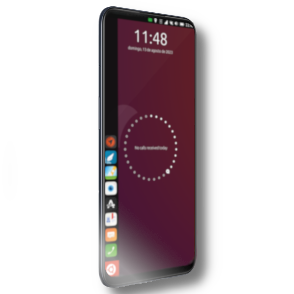

# OnePlus Nord N100
______________________

______________________
OnePlus Nord N100

OnePlus Nord N100 (billie2) specs
==========================================

| Basic                   | Spec Sheet                                                                                                                     |
| -----------------------:|:------------------------------------------------------------------------------------------------------------------------------ |
| CPU                     | Octa-core (4x1.8 GHz Kryo 240 & 4x1.6 GHz Kryo 240)                                                                                                                      |
| Chipset                 | Qualcomm SM4250 Snapdragon 460 (11 nm)                                                                                                            |
| GPU                     | Adreno 610                                                                                                                   |
| Memory                  | 4 GB RAM                                                                                                                     |
| Shipped Android Version | Android 10, OxygenOS 10.5                                                                                                                           |
| Storage                 |64GB                                                                                                                  |
| Battery                 | Li-Po 5000 mAh, non-removable battery                                                                                           |
| Display                 | 720 x 1600 pixels, 20:9 ratio (~269 ppi density)                                                                            |
| Camera (Back)(Main)     | 13 MP, f/2.2, (wide), PDAF 2 MP, f/2.4, (macro) 2 MP, f/2.4, (depth)                                                                                |
| Camera (Front)          | 8 MP, f/2.0
# What works so far?

### Progress
 Ubuntu 20.04 Focal

- [ ] Recovery
- [ ] Boot
- [ ] Bluetooth
- [ ] Camera Fotos and Video Recording
- [ ] Docker
- [ ] GPS
- [ ] NFC
- [ ] Audio works
- [ ] Bluetooth Audio
- [ ] Waydroid
- [ ] MTP
- [ ] ADB
- [ ] SSH
- [ ] Online charge
- [ ] Offline Charge
- [ ] Wifi
- [ ] Calls
- [ ] Mobile Data 2G/3G/4G (LTE)
- [ ] Ofono
- [ ] SDCard
- [ ] Wireless display ( reminder that wireless display works on 2.4ghz networks )
- [ ] Fingerprint Reader
- [ ] OTG Works
- [ ] Camera Flash
- [ ] Manual Brightness Works
- [ ] Switching between cameras
- [ ] Hardware video playback
- [ ] Rotation
- [ ] Proximity sensor
- [ ] Virtualization
- [ ] GPU
- [ ] Lightsensor
- [ ] Proximity sensor
- [ ] Automatic brightness
- [ ] Torch
- [ ] Hotspot
- [ ] Airplane Mode
### Extras
- [ ] Waydroid auto start if installed
- [ ] Waydroid Resolution fix cut buttons on height (After first run)

### For internal use these link should not be shared public